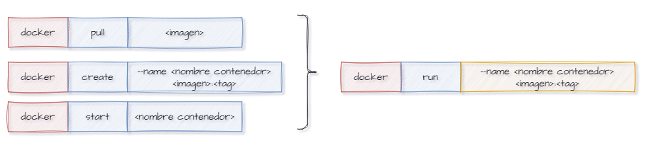

# Contenedores

### Crear un contenedor
Para crear un nuevo contenedor Docker a partir de una imagen específica, pero sin iniciarlo automáticamente. 

```
docker create --name <nombre contenedor> <nombre imagen>:<tag>
```
Crear el contenedor  **srv-web** usando la imagen nginx version alpine


# COMPLETAR

Si creas un contenedor en Docker sin asignarle un nombre específico utilizando la opción --name, Docker asignará automáticamente un nombre aleatorio al contenedor. Este nombre suele consistir en una combinación de palabras y números.  

Crear el contenedor usando la imagen hello-world


# COMPLETAR

### Listar los contenedores ejecutándose o no

```
docker ps -a
```


### Para iniciar un contenedor

```
docker start <nombre contenedor o identificador>
```
Iniciar el contenedor srv-web


# COMPLETAR

### Listar los contenedores ejecutándose
```
docker ps 
docker ps | grep <nombre contenedor>
```
docker ps


docker ps | find "srv-web"


### Para detener un contenedor

```
docker stop <nombre contenedor>
```


### Para crear un contenedor y ejecutarlo inmediatamente

```
docker run --name <nombre contenedor> <nombre imagen>:<tag>
```


Crear y ejecutar inmediatamente el contenedor **srv-web2** usando la imagen nginx:alpine


# COMPLETAR

**¿Qué sucede luego de la ejecución del comando?**

El comando crea y ejecuta un contenedor llamado srv-web2 con la imagen nginx:alpine. Luego se inicia el servidor nginx en primer plano, mostrando su salida en la terminal, debido a que, la terminal queda como si estuviera ejecutando un proceso, es decir ocupada.
# COMPLETAR  

Cuando ejecutas un contenedor en primer plano sin la opción -d (modo detach), el contenedor captura la entrada estándar (stdin) del terminal, lo que significa que el terminal queda "atrapado" y no puedes introducir más comandos hasta que detengas el contenedor.

### Para crear un contenedor y ejecutarlo inmediatamente sin estar vinculados al mismo
-d: Es la opción que indica a Docker que ejecute el contenedor en segundo plano (en modo "detach").
Cuando un contenedor se ejecuta en segundo plano, Docker devuelve el control al terminal inmediatamente después de iniciar el contenedor, lo que permite al usuario seguir ejecutando otros comandos en el mismo terminal sin que el contenedor detenga la interacción.

```
docker run -d --name <nombre contenedor> <nombre imagen>:tag
```
Crear y ejecutar inmediatamente el contenedor **srv-web3** en modo detach usando la imagen nginx:alpine


# COMPLETAR

### Para eliminar un contenedor

```
docker rm <nombre contenedor>
```
Eliminar el contenedor que se creó a partir de la imagen hello-world 


# COMPLETAR

Verificar que el contenedor que se eliminó


# COMPLETAR

### Para eliminar un contenedor que esté ejecutándose

```
docker rm -f <nombre contenedor>
```
Eliminar el contenedor **srv-web3** 


# COMPLETAR

Verificar que el contenedor que se eliminó


# COMPLETAR

### Para inspecionar un contenedor 

Inspeccionar el contenedor **srv-web** 


# COMPLETAR
