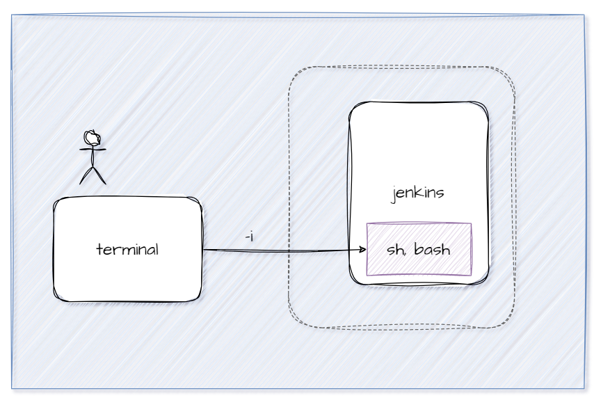
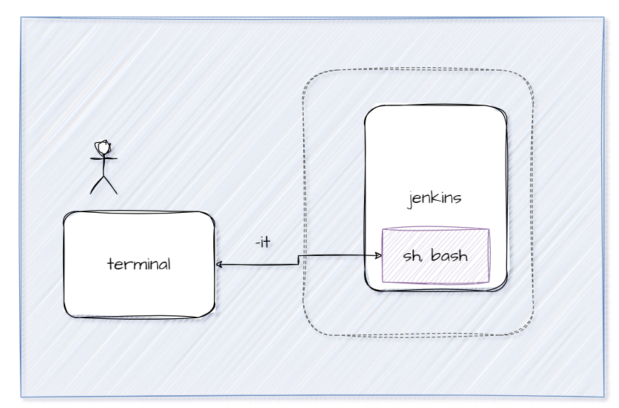

# Operaciones con contenedores

### Ejecutar un comando en un contenedor de Docker en ejecución
```
docker exec <nombre contenedor> <comando> <argumentos opcionales>
```
# COMPLETAR
### ¿Para qué se usa el comando ls?
Sirve para en listar archivos de un directorio

### ¿Para qué sirve el argumento -l junto al comando ls?
Para enlistar y visualizar los atributos de los archivos.

### Usar el contenedor de jenkins creado previamente y ejecutar el comando ls con el argumento -l
# COMPLETAR
# COLOCAR UNA CAPTURA DE PANTALLA


### Para ejecutar un shell interactivo en un contenedor de Docker especificado.
El comando **docker exec** te permite acceder a la sesión shell de un contenedor en ejecución, estarás dentro del contenedor y podrás ejecutar comandos como si estuvieras en una terminal normal. 
Para saber qué comando utilizar para abrir una terminal dentro de un contenedor, es útil conocer la imagen base del contenedor, ya que diferentes imágenes pueden usar diferentes shells o comandos para abrir una terminal. Puedes verificar la documentación de la imagen del contenedor en Docker Hub o en el repositorio de la imagen para obtener información específica sobre cómo abrir una terminal en esa imagen.
- Para imágenes basadas en Debian o Ubuntu, puedes probar con bash.
- Para imágenes basadas en Alpine Linux, puedes probar con sh.

```
docker exec -i <nombre contenedor> <programa o comando>
```
-i: mantiene abierta la entrada estándar (stdin) del contenedor. Esto significa que puedes enviar datos al proceso que se está ejecutando en el contenedor a través de la terminal local. *Sin embargo, esto no asigna un terminal al contenedor, por lo que no podrás ver la salida del proceso de forma interactiva.*


### Ejecutar una de las siguientes instrucciones
```
docker exec -i <nombre contenedor> /bin/bash 
```
ó
```
docker exec -i <nombre contenedor> bash 
```


**Considerar**
- /bin/bash: Al especificar la ruta completa del shell, Docker buscará el ejecutable /bin/bash en el sistema de archivos del contenedor y lo ejecutará. Esto es útil cuando quieres asegurarte de que se está utilizando un shell específico que está ubicado en una ubicación conocida en el sistema de archivos del contenedor. 
- bash: Al especificar solo el nombre del shell, Docker buscará el comando bash en las rutas del sistema (por lo general, en las rutas definidas en la variable de entorno PATH) del contenedor y lo ejecutará. Esto asume que bash está disponible en alguna de las rutas del sistema definidas en el contenedor.

Mostrar el contenido del archivo /etc/shells, que contiene una lista de shells válidos en el sistema.

docker exec -it jenkins cat /etc/shells


Ejecutar
```
echo "Hola mundo"
```


Ejecutar
```
whoami
```


# COLOCAR UNA CAPTURA DE PANTALLA

**Si se visualiza el mensaje command not found, considerar**
El problema se debe a que no se ha asignado un terminal de salida al contenedor al ejecutar el comando. Cuando usas docker exec -i jenkins-server /bin/bash en Windows, el comando se ejecuta pero no hay un terminal asignado para mostrar la salida del comando.


### Para ejecutar un shell interactivo bidireccional en un contenedor de Docker especificado.
Ejecutar un shell interactivo bidireccional en un contenedor de Docker significa abrir una sesión de shell en el contenedor que permite la interacción bidireccional entre la terminal local y el contenedor. Es decir, puedes enviar comandos desde tu terminal local al contenedor y recibir la salida de esos comandos de vuelta en tu terminal local, al igual que si estuvieras trabajando directamente en la terminal del contenedor.


```
docker exec -i-t <nombre contenedor> <programa o comando>
```
ó
```
docker exec -it <nombre contenedor> <programa o comando>
```


### Ahora puedes acceder al contenedor de jenkins y obtener la contraseña ubicada en /var/jenkins_home/secrets/initialAdminPassword


# COMPLETAR

### Colocar una captura de pantalla de la ventana que aparece después de colocar la contraseña.


**Para este punto no es necesario continuar con la instalación de Jenkins**


### Para ver los logs de un contenedor

```
docker logs -n <cantidad de líneas> <nombre o id del contenedor> 
```
-t: para incluir la fecha y la hora


